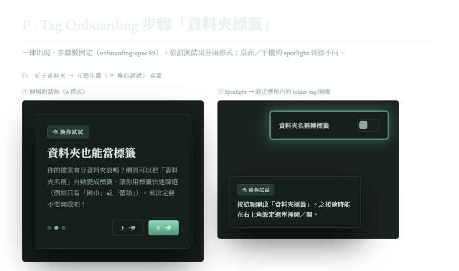

# Spec：使用者 Onboarding 教學

> ✅ **狀態：已實作**。目前共 **8 大步**教學(混合對話框 + spotlight)已落地(獨立 controller,`OB_SEEN_KEY = "wlib-onboarding-seen"`,`maybeAutoOnboarding()` 首次觸發、設定選單 `#replayOnboarding` 重看入口)。§9 的「資料夾標籤」步驟與單步播放(`playFoldertagStep()`)**已實作**;原 v1「萬一 links.md 壞掉」步一度因 `.broken` 敘述誤導而移除,**壞檔守門上線後(v1.8.2)以誠實版本寫回**(整份壞才自動救回＋備份 `.broken`,只壞一兩行會被略過故提醒改完按重新整理;見 `broken-file-recovery-spec.md`、§9.6)。步序真相以 §9.6 表為準。本文件轉為「行為真相 + 後續維護依據」;教學內容隨 app 功能擴充仍需同步維護(見 §7 ⚠️)。
>
> 這份文件是 onboarding 教學的需求說明書。
> 教學內容會隨 app 功能擴充而持續更新，本 spec 也會同步維護（見 §7 ⚠️）。

---

## 1. 目的

幫助使用者建立 app 的心智模型，降低後續踩雷的機率，特別是這幾個設計細節：

- 「資料夾 = 真相」的設計理念
- 「一次服務一個資料夾」的定位（更換資料夾 = 清快取重新開始，舊資料夾內容不動）
- 「重新整理」按鈕的雙重職責（本機檔案掃描 + 重讀 `links.md`）
- URL 收藏跟本機檔案使用兩套不同的同步邏輯
- `links.md` 和 `thumbs/` 是 app 幫使用者建在資料夾裡的，屬於使用者，可以自己搬

教學是補課性質，不是強制流程，但完全不看會踩雷（尤其外部編輯 `links.md` 的場景）。所以採取「首次出現 + 可關閉 + 可隨時重看」的折衷。

---

## 2. 觸發時機

### 2.1 自動跳出（首次）

- 條件：
  - 使用者第一次成功選擇資料夾
  - 首次掃描開始、**渲染進行中即可同步開始教學**（不必等渲染跑完；心智模型那幾步用對話框，使用者讀文字的同時封面在背景慢慢畫）
  - localStorage 中沒有 `wlib-onboarding-seen` 紀錄（或值小於當前版本，見 §3.2）
- 形式：**並非整場都是全螢幕遮罩 + 中央對話框**。依步驟切換：
  - 心智模型步驟（資料夾=真相、換資料夾會覆蓋、`links.md` ／ `thumbs/` 位置、災難復原）→ 全螢幕遮罩 + 中央對話框
  - 功能巡禮步驟（頂欄按鈕、dock 三顆、卡片放大鏡）→ **點擊式 wizard**（spotlight ／ coach mark），圈出真實 UI 元件 + 旁邊一段說明氣泡
  - 細節形式規範見 §3

### 2.2 重新觀看（手動）

- 入口：頂欄右側的設定齒輪選單，新增一項「重看使用教學」
- 點擊後直接跳出，不需要重置 localStorage

### 2.3 不會自動跳的情境

- 後續打開 app（cache 直出，不需選資料夾）
- 更換資料夾後（同一台瀏覽器，localStorage 已標記過）
- 已標記版本 ≥ 當前版本

---

## 3. 形式

### 3.1 互動模式：混合制（對話框 + 點擊式 wizard）

整場教學是同一支多步驟流程，但每步可以是兩種形式之一，依該步要傳達的內容決定：

**A. 全螢幕對話框**（用於心智模型、抽象說明）

- 整個畫面被半透明遮罩蓋住，**遮罩外點擊不關閉**（避免誤觸）
- 中央一個對話框，包含：
  - 標題
  - 內容區塊（文字為主，必要時可加 icon ／ 小插圖）

**B. 點擊式 wizard ／ spotlight**（用於指真實 UI 元件：頂欄按鈕、dock、卡片放大鏡等）

- 半透明遮罩**鏤空**目標元件，讓元件本身亮起來、可以被看見
- 旁邊浮出說明氣泡（類似 tooltip，但帶步驟控制），內容區塊同 A
- 鏤空區的點擊處理：**v1 預設純說明，遮罩攔截點擊以避免誤觸**
  - **唯一例外：「試試新增網址」這一步真的能點**——使用者按下 spotlight 圈起的「新增網址」鈕後，正常開啟新增對話框，完整走完「填網址 → 儲存」流程，真的會在 `links.md` 寫進一筆新網址，儲存完才推進下一步；這一步 focus trap 範圍要擴到「氣泡 + 新增網址鈕 + 開啟後的整個對話框」。**子流程細節見 §4 Step 4**。
  - 其他功能（搜尋、幻燈片、排序、檢視大小、來源篩選等）只圈出來搭文字說明，不要求動手
- **互動步驟才標示模式**（避免使用者猜要不要動手）：
  - 純說明（看過就好）步驟：**不顯示徽章**
  - 互動步驟：徽章顯示「🖱 換你試試」，spotlight 周圍多一圈呼吸光暈當視覺提示

**兩種形式共用的步驟控制**（底部 ／ 氣泡尾端）：

- 步驟指示器（例：●○○○○，顯示目前第幾步 ／ 共幾步）
- 「上一步」「下一步」按鈕（第一步無上一步；最後一步的「下一步」改成「我知道了」）
- 右上角小叉叉「跳過」（點了等同看完，localStorage 會標記為已看過）

⚠️ spotlight 的 z-index 要算在燈箱（z 50）與紋理覆蓋層（z 40）之上，建議遮罩 z 60、鏤空+氣泡 z 61。視窗 resize 時要重算目標元件座標。

### 3.2 版本管理

localStorage key：`wlib-onboarding-seen`，值為版本字串（例 `"v1"`，跟隨教學內容大改版升版）。

- v1 第一次推出：有值 → 不跳；無值 → 跳
- 未來內容大改版（v2 等）：把比對邏輯擴成「localStorage 值 < 當前版本 → 觸發升版 toast」
- ⚠️ 不要每次小修都升版，避免擾民
- **升版行為**：
  - **大升版**（v1 → v2 這種）：視窗頂部中央顯示「有更新！」toast（**注意「！」為全形驚嘆號**，非半形「!」）；toast 可點，使用者點下去從 Step 1 重播所有教學
  - **小升版**：不跳任何東西

---

## 4. 教學內容（v1）

> 內容隨 app 功能擴充逐步補充。目前以 url-spec.md §11.1 既有內容為起點，以下是 v1 的步驟拆解。
>
> ⚠️ 本節是 v1 的原始拆解、**保留原編號未重排**；實際播放順序以 §9.6 的表為準（目前共 **8 大步**）。與 v1 相比有兩處變動：（1）原 **Step 2「萬一 links.md 壞掉」**曾因 `.broken` 敘述誤導而一度移除，**壞檔守門上線後（v1.8.2）以誠實版本寫回**——整份壞才自動救回＋備份 `.broken`，只壞一兩行會被容錯略過，故文案改為提醒「手動改完 md 記得按重新整理確認」（見 `broken-file-recovery-spec.md`）；（2）已插入**新的「資料夾標籤」步驟**（規格見 §9.1、文案真相見 `tag-spec.md` §9a）。Step 1a 文案也已改為支援子資料夾。

### 開場：歡迎（封面）

模式：👀 看過就好（封面，**不顯示徽章、不計入下方 8 步的步驟點**）

標題：「歡迎來到編織圖圖書館！」

內容：

```
第一次進來，先看看這個網站的功能和注意事項吧。
```

### Step 1：兩種資料的同步方式

模式：👀 看過就好

> 內容較長，拆成兩個對話框（同屬大步 1，步驟指示器都停在第 1 點）。

**Step 1a** — 標題：「檔案和網址兩種收藏」

```
PDF ／ 圖片檔案：
→ 以資料夾裡實際有的檔案為準
→ 連同子資料夾裡的檔案都會讀，全部檔案的預覽圖都會一起顯示
→ 動了資料夾中的檔案（新增／改名／刪掉），要按「重新整理」才會跟著更新
```

（第 2 行已隨子資料夾遞迴上線同步改過，草稿真相見 `subfolder-spec.md` §9a。）

**Step 1b** — 標題：「🔗 網址收藏」

```
🔗 網址：
→ 網頁會自動在你資料夾裡建一個 `links.md` 和 `thumbs/` 資料夾，
  用來存放網址清單和預覽圖（檔名會是一串英數字）
→ 平時用網頁裡的按鈕新增／編輯／刪除網址資料即可
→ 想的話也可以用記事本等文字編輯軟體
  直接打開 `links.md` 來改（要注意內容格式）
```

### Step 2：萬一 links.md 壞掉或不見（誠實版，v1.8.2 寫回）

模式：👀 看過就好

標題：「萬一 links.md 壞掉或不見」

內容（文案真相以 `constants.js` `OB_SCREENS` macro 2 為準）：

```
你的網址收藏，網頁隨時留著一份副本。
萬一 links.md 整個讀不到、或格式壞到完全認不得，
網頁會自動用副本救回，
並把壞掉的原檔改名成 links.md.broken-{時間} 完整保留，
你不會兩頭空。

小提醒：如果你自己用文字編輯器改 links.md，
只改壞其中一兩行的話，那幾行可能會被安靜略過；
改完記得按「重新整理」確認東西都在。
```

⚠️ 這一步是**範圍誠實**的：`.broken` 自動備份只在「**整份壞掉／讀不到**」時真的觸發（守門見 `broken-file-recovery-spec.md`）；「**只壞一兩行**」仍是容錯靜默略過、不備份，故文案末段明確提醒使用者手動改完要按重新整理確認。**不要**改回 v1 那種「任何格式打錯都會自動救回並可撿回」的說法（那對壞一行不成立、會誤導）。

### Step 3：「重新整理」按鈕的意義

模式：👀 看過就好

標題：「右上角的『重新整理』」

內容：

```
這個按鈕會一口氣做兩件事：
1. 重新看一次資料夾裡有哪些 PDF ／ 圖片
2. 重新讀一次 `links.md`，把你改過的網址收藏內容讀進來

✅ 什麼時候要按：
- 動了資料夾中的檔案（新增／改名／刪掉）
- 改了 `links.md`，想立刻在網頁上看到結果
- 打開網頁後，懷疑畫面跟資料夾裡實際的東西不一樣

🛟 不會因為重新整理弄丟你的收藏：重新整理只讀取不寫入。
```

（上線後追加：對話框之後接一個 **spotlight 指向設定選單內的「重新整理」鈕**——先展開選單並鎖住、純說明，氣泡「「重新整理」收在右上角的設定選單裡，就是這顆。」，見 §9.6 變更 1。）

### Step 4：試試新增網址

模式：🖱 換你試試（§3.1 O9 唯一互動步驟）

標題：「試試把一個網址收進來」

子流程依序：

1. **開場對話框**（淡入後讀一下、按「下一步」推進到 spotlight）：

   ```
   網頁右上角的「新增網址」鈕可以
   把網頁／影片連結收進你的資料夾。

   來試試吧！
   ```

2. **Spotlight 1：頂欄「新增網址」鈕**（呼吸光暈）

   氣泡：「按這顆，跳出新增視窗。」

   觸發條件：使用者按下該鈕 → 新增對話框開啟 → 推進。

3. **Spotlight 2：對話框的「網址」欄位**

   氣泡：

   ```
   貼上任一網址試試。
   不知道貼什麼？可以複製這個 YouTube 首頁：
   https://www.youtube.com/
   ```

   觸發條件：欄位值含 `://` 且平台偵測完成（`#platformTxt` 不再是初始提示）→ 推進。

4. **Spotlight 3：對話框的「縮圖」區**

   氣泡：

   ```
   YouTube 連結會自動產生縮圖。
   其他網站可以用檔案／拖拉／貼上自訂縮圖。
   這次不用真的上傳，看一下就好。
   ```

   觸發條件：使用者按氣泡上的「下一步」鈕 → 推進。

5. **Spotlight 4：對話框的「儲存」鈕**

   氣泡：「按下儲存，這筆網址就會真的寫進 `links.md`。」

   觸發條件：使用者按下儲存（有效網址、確實嘗試寫入）→ 寫入成功則對話框關閉、新卡片進入畫面、**自動推進**。
   - **防卡死的手動 fallback**：氣泡的「下一步」鈕**預設隱藏**，按過儲存（無論成敗）後才出現。萬一寫入失敗（授權被撤、資料夾不見），使用者可按這顆手動推進；**完全沒按過儲存則不可能推進**。

⚠️ 互動範圍：子流程 2 只有「新增網址鈕」可點（透明點擊代理轉發），其餘一律遮罩攔截；子流程 3-5 整個新增對話框可操作，且**教學期間鎖死對話框不可關閉**（取消鈕／點遮罩無效，Esc＝跳過教學）。**「儲存」鈕在子流程 3-4 也被攔截**——提前儲存會寫入並關掉對話框、教學流程錯亂；只有走到子流程 5（儲存那一步）才放行。v1 不做鍵盤 focus trap ／ aria。

### Step 5：其他常用按鈕

模式：👀 看過就好

標題：「其他常用按鈕」

依序 spotlight 圈起以下元件，每個元件一個短氣泡，按氣泡上的「下一步」推進：

1. **幻燈片鈕**（頂欄）：「從第一張開始，全螢幕逐張看」
2. **檢視大小**（dock）：「卡片預覽可以切寬大 ／ 標準 ／ 緊湊」
3. **排序**（dock）：「依檔名 ↔ 依修改時間切換；切到時間排序會用月份分組成時間軸」
4. **來源篩選**（dock）：「全部 ／ 檔案 ／ 網址篩選檢視」

（上線後調整：原第 2 顆「設定（頂欄齒輪）」spotlight **已移除**——「重新整理」「更換資料夾」各自在 Step 3／Step 6 有指向選單項的 spotlight，見 §9.6 變更 2。）

### Step 6：「更換資料夾」是重新開始

模式：👀 看過就好

標題：「換資料夾 = 重新開始」

內容：

```
這個網頁一次只能呈現一個主資料夾與其底下資料夾的內容。

選了新的主資料夾，網頁會：
把之前的封面「預覽圖」全清掉。從新資料夾重新讀取「預覽圖」和網址收藏

🛟 舊資料夾的內容不會跟著消失：
- 你的 PDF ／ 圖片本來就在那裡，不會被動
- 之前在網頁裡收藏的網址，都還在
  舊資料夾最外層的 `links.md`，
  縮圖存在舊資料夾的 `thumbs/` 子資料夾
- 這兩個是網頁幫你建的，但它們屬於你
- 想把網址收藏帶到新資料夾？
  在檔案總管把這兩個搬過去就行
```

（上線後追加：對話框之後接一個 **spotlight 指向設定選單內的「更換資料夾」鈕**——先展開選單並鎖住、純說明，氣泡「「更換資料夾」也在設定選單裡，想換的時候按這顆。」，見 §9.6 變更 3。）

### Step 7：結尾

模式：👀 看過就好

標題：「準備好了！」

內容：

```
教學結束。
之後想再看一次，點右上角的設定齒輪 →「重看使用教學」就行。

開始整理你的編織資料夾吧！
```

底部按鈕：「我知道了」（取代「下一步」）

---

## 5. 設計細節

整段已搬到 [`design-style.md`](design-style.md)。onboarding 沿用全站既有 design system，不引入第三套配色 ／ 字體 ／ 花飾規範。對應對照：

- 對話框（A 模式）→ `design-style.md` §7.4
- spotlight 氣泡（B 模式）→ `design-style.md` §7.11
- 配色 ／ 字體 ／ 動效 → `design-style.md` §2、§3、§6
- 花飾（`--sprig` 對角、`--swash` 主按鈕） → `design-style.md` §8

---

## 6. 已決定事項一覽

| #   | 議題                     | 決定                                                                                                                                                                                                             |
| --- | ------------------------ | ---------------------------------------------------------------------------------------------------------------------------------------------------------------------------------------------------------------- |
| O1  | 首次觸發時機             | 第一次成功選資料夾後、**渲染一開始就同步進入教學**（不等渲染跑完）                                                                                                                                               |
| O2  | 重看入口                 | 頂欄設定齒輪選單裡新增「重看使用教學」                                                                                                                                                                           |
| O3  | localStorage key 與版本  | `wlib-onboarding-seen`，值為版本字串（v1 起跳）                                                                                                                                                                  |
| O4  | 形式                     | **混合制**：心智模型用全螢幕對話框、功能巡禮用點擊式 wizard ／ spotlight（見 §3.1）                                                                                                                              |
| O5  | v1 內容                  | 7 步，見 §4（含 1 步互動式「試試新增網址」+ 1 步合併工具列巡禮）。「歡迎 + 設計理念」直接寫在 `index.html` 首頁 `.why` 區塊，不重複進 wizard。後續開發補充                                                       |
| O6  | 跳過 vs 完成             | 兩者都標記為「已看過」，避免擾民                                                                                                                                                                                 |
| O7  | 遮罩外點擊               | 不關閉教學（避免誤觸）                                                                                                                                                                                           |
| O8  | 多資料夾支援             | v1 不支援。一次服務一個資料夾，換資料夾即清 IndexedDB 快取重新開始；舊資料夾的 `links.md` 與 `thumbs/` 不動，使用者可自行搬到新資料夾                                                                            |
| O9  | 點擊式 wizard 的互動範圍 | v1 **只有「試試新增網址」一步真的能點**（走完開對話框→填→存的完整流程，會真的寫一筆進 `links.md`）；其餘 spotlight 步驟一律純說明、遮罩攔截點擊。**只有互動步驟顯示「🖱 換你試試」徽章；看過就好步驟不顯示徽章** |
| O10 | 升版 toast 行為          | **大升版**（v1→v2 這種）：視窗頂部中央顯示可點的「有更新！」toast（**全形驚嘆號**），點下去從 Step 1 重播全部教學。**小升版**：不跳任何東西、不升 localStorage 版本字串                                          |
| O11 | 重看教學的起點           | **不支援**「從某一步開始」。重看入口（§2.2）與升版 toast（O10）一律從 Step 1 重播全部                                                                                                                            |

---

## 7. 與其他 spec 的關係

### 7.1 與 url-spec.md 的對應

教學內容與 url-spec.md 的對應：

| url-spec.md 原位置            | 處理                                                |
| ----------------------------- | --------------------------------------------------- |
| §11.1.1 hover tooltip         | 留在 url-spec.md（UI 元件提示，非 onboarding 流程） |
| §11.1.2「Onboarding 對話框」  | 整段搬到本文件 §3、§4                               |
| §11.1.3 toast 回饋            | 留在 url-spec.md（CRUD 動作回饋，非 onboarding）    |
| §11.1.4「隨時可開的說明連結」 | 整合到本文件 §2.2「重新觀看」入口                   |

### 7.2 與 folder-switch-spec.md 的對應

「更換資料夾」相關內容拆兩邊：

| 內容                                                | 文件                    |
| --------------------------------------------------- | ----------------------- |
| 「換資料夾 = 重新開始」的心智模型（事前教育）       | 本文件 §4 Step 6        |
| 「一次服務一個資料夾」的定位決定                    | 本文件 §1 ／ §6 O8      |
| 換資料夾當下的 confirm dialog、清快取順序、邊界情境 | `folder-switch-spec.md` |

### 7.3 同步維護義務

⚠️ **以下任一文件變動，都要回頭 review 本文件 §4**（避免教學跟實際行為不符）：

- `About.md` 變動：
  - §3 執行方式 ／ 瀏覽器需求變動 → review §4 全部步驟（前提條件可能改變）
  - §6 功能總覽新增 ／ 移除 ／ 改名 → review §4 對應功能巡禮步驟（含徽章模式 O9）
  - §9 已知限制變動 → review §4 對應踩雷區說明（例如「只讀資料夾最外層」「不遞迴子資料夾」這類描述）
  - §11「改動時的注意事項」變動 → review `design-style.md`（配色、字體、花飾、`backdrop-filter` 禁令等對齊）
- `url-spec.md` 核心設計變動（refresh 職責、cache 同步方向、災難復原行為）→ review §4 Step 3（refresh）／ Step 5（新增網址流程）。⚠️ 災難復原行為若再變動（例如壞一兩行也改成會備份／throw），要回頭同步「Step 2 萬一 links.md 壞掉」的教學文案（現為誠實版，整份壞才救回；見 §9.6、`broken-file-recovery-spec.md`）
- `folder-switch-spec.md` 流程或 confirm dialog 文案變動 → review §4 Step 6（兩邊文案要對齊）

---

## 8. 開工前最後的確認項

（無）所有議題已決定，參見 §6。

---

## 9. 子資料夾 ／ 資料夾標籤上線的教學增修（✅ 已實作）

> 以下增修已隨 `subfolder-spec.md`（遞迴掃描）、`tag-spec.md`（資料夾標籤）一起**落地**：新 Step 4（`OB_SCREENS` 的 `when: "sub"/"flat"` 條件畫面）、單步播放 `playFoldertagStep()`、「先不開啟」次要鈕（`#obBubbleAlt`）、選單鎖定（`obSyncMenu`＋`obMenuLock`）、spotlight 目標分流（`targetM`）。
>
> ✅ **手動 tag 純說明子畫面（子流程 ③）已實作**——`OB_SCREENS` 加入標題「也能自己貼標籤」的 A 模式對話框（文案常數 `OB_MANUAL_TAG_BODY`），在 Step 4「資料夾標籤」的開關 spotlight 之後、篩選區 spotlight 之前，**只說明「可手動加 tag」與「tag 存在 `files.md`／`links.md`」**（孤兒警語改放編輯標籤彈窗底部小灰字，不在 onboarding，`tag-spec.md` §11.6.2），有／無子資料夾都播。實際子流程：sub＝「開場→開關→**手動 tag 純說明**→篩選區」；flat＝「開場→**手動 tag 純說明**」。`OB_TOTAL` 維持 8、不升版。

### 9.1 新增步驟：「資料夾標籤」

**一律出現於新使用者的 onboarding 序列**（步驟數固定，不因資料夾結構增減）。**位置：插在「重新整理」之後、「試試新增網址」之前**。⚠️ 目前 8 大步下這是 **Step 4**（`OB_TOTAL`＝8、`OB_TAG_MACRO`＝4；「links.md 壞掉」誠實版寫回後步序回到 8），實際步序見 §9.6。形式依偵測結果分兩種：

- **有子資料夾** → **互動步驟**（🖱 換你試試，序列中**第一個**互動步驟，先於「試試新增網址」）。子流程：
  1. **開場對話框**：說明子資料夾檔案已攤平顯示、資料夾名可當標籤篩選；
  2. **開關 spotlight（互動）**：按下開關＝開啟、寫入 `tag-spec.md` §4a 的持久偏好並推進（「做了會生效」，比照「試試新增網址」的「儲存」）；氣泡另設**「先不開啟」次要鈕**＝寫入 `"off"` 並推進，不想開的人不必跳過整場教學；
  3. **手動 tag 純說明（👀）**：**併入本步、放在篩選區 spotlight 之前**——一張 A 模式對話框，只說明「檔案／網址也能自己貼標籤」與「這些 tag 存在 `files.md`／`links.md`、屬於你可自搬」。孤兒警語不在此、改放編輯標籤彈窗小灰字（`tag-spec.md` §11.6.2）。**純說明、不需操作**（`tag-spec.md` §9a、T27）。
  4. **篩選區 spotlight（純說明 👀）**：**併入本步**（不放工具列巡禮）——tag 介面在桌面與手機都與搜尋欄同屬一個篩選區，開關選完接著介紹。桌面指 header 下的篩選區；手機指 dock 第 4 顆「篩選」鈕。
- **無子資料夾（平資料夾）** → **純說明步驟**（👀 看過就好）：開場對話框＋**手動 tag 純說明對話框**（同上子流程 ③，手動 tag 與子資料夾無關，故兩形式都播），**不給開 ／ 關選擇、不播篩選區 spotlight**。

### 9.2 兩個進入點（共用同一步驟版面）

- **新使用者**：走 onboarding 序列時，偵測到子資料夾才插入此步。
- **既有使用者**：點上線 toast（`subfolder-spec.md` §6）→ 重新整理掃出子資料夾 → **單獨播放此一步**（不重播整場教學）。
- 兩條路寫**同一個 localStorage 偏好**，不重複詢問。

### 9.3 連帶修改（實作時一起改）

- **Step 1a 文案**（§4）：「只讀一層資料夾，不會讀子資料夾」→ 改為支援多層子資料夾。
- **O9 例外**（§6）：不再是「v1 只有『試試新增網址』一步能互動」；新增「資料夾標籤」為互動步驟，且位於「試試新增網址」**之前**（成為序列中第一個互動步驟）。
- **工具列巡禮不新增篩選列 spotlight**：篩選區介紹已併入「資料夾標籤」步驟（§9.1 子流程 ④）；原 Step 5 巡禮內容不變。
- **O11 例外**（§6）：O11 原則為「重看 ／ 升版一律從 Step 1 重播全部、不支援從某一步開始」；**本次新增例外——上線 toast 只播放單一『資料夾標籤』步驟**（feature-launch 單步播放，與「重看教學」「升版重播」的整場重播區隔）。
- **不為此升 onboarding 版本**：既有使用者靠 toast 單步播放涵蓋，不觸發整場升版重播。

### 9.4 其他決定

- **跳過此步 → 寫入 `wlib-foldertag = "off"`**（含跳過整場教學、關閉單步播放），之後不再自動詢問，改由設定選單切換（`tag-spec.md` §4a）。
- **單步播放的版面**：隱藏步驟指示點與「上一步」；「✕」＝關閉，視同「先不開啟」（寫入 `"off"`）。
- 因步驟**一律出現**（§9.1，只是形式不同），**步驟指示器數量固定**，不需處理條件步驟的動態計數。

### 9.5 教學文案位置

實作時逐字移入 `js/constants.js` 的 `OB_SCREENS`。草稿真相分放於各功能 spec：

- **Step 1a 修改**（「檔案」段改為支援子資料夾）：`subfolder-spec.md` §9a。
- **新步驟「資料夾標籤」**（互動 ／ 純說明兩形式）＋**手動 tag 純說明**（可手動加 tag、tag 存 `files.md`／`links.md`；孤兒警語改放編輯彈窗小灰字）＋篩選列 spotlight：`tag-spec.md` §9a。

### 9.6 教學步驟順序（重排，✅ 已實作）

> 隨子資料夾 ／ tag 上線、以及壞檔守門（v1.8.2）一起調整。v1 原為 7 大步；加入「資料夾標籤」成 8、「links.md 壞掉」步一度移除回到 7，壞檔守門上線後以**誠實版本寫回**又回到 **8**（`OB_TOTAL`＝8，步驟指示器一併更新）。粗體為對 v1 的變更。

| 新步序 | 內容 | 對 v1 的變更 |
| --- | --- | --- |
| 1 | 兩種收藏 | Step 1a「檔案」段改支援子資料夾（文案 `subfolder-spec.md` §9a） |
| 2 | 萬一 `links.md` 壞掉／不見 | **誠實版寫回**（v1.8.2 壞檔守門）：整份壞才自動救回＋備份 `.broken`，只壞一兩行會被容錯略過，故提醒「手動改完按重新整理確認」（見 `broken-file-recovery-spec.md`；§4 Step 2） |
| 3 | 重新整理 | **保留原對話框說明，額外加一個 spotlight 指向設定選單的「重新整理」鈕**（變更 1） |
| 4 | **資料夾標籤（新步驟）** | **新增**：互動時開 ／ 關 folder-tag（文案 `tag-spec.md` §9a）；**手動 tag 純說明（可手動加 tag、tag 存放位置；孤兒警語改放編輯彈窗小灰字）＋篩選區 spotlight 併入本步**（§9.1 子流程 ③④） |
| 5 | 試試新增網址（互動） | 位置後移 |
| 6 | 工具列巡禮 | **刪掉「設定選單裡有『重新整理』和『更換資料夾』」那顆 spotlight**（變更 2；兩者已各自有 spotlight＝步序 3／7），剩幻燈片＋dock 三顆 |
| 7 | 更換資料夾 | **保留原對話框說明，額外加一個 spotlight 指向設定選單的「更換資料夾」鈕**（變更 3） |
| 8 | 結尾 | — |

**實作注意（spotlight 指下拉選單項）**：「重新整理」與「更換資料夾」都在頂欄設定齒輪的**下拉選單內**、平時收合。步序 3／7 的 spotlight 先**展開設定選單並鎖住**再定位（復用 §9.1-② 的 `menu: true` 機制；純說明、遮罩攔截點擊）。

**互動步驟現有兩個**（資料夾標籤 + 新增網址）→ O9 例外已記於 §9.3。篩選區 spotlight **併入步序 4「資料夾標籤」**（不放工具列巡禮，維持 §9.1 與 `tag-spec.md` §9a 的定案）。

### 9.7 設計規格（implementation-ready）

> 由設計階段回填。互動稿見 `Tag Feature Designs.dc.html`（§F），截圖 `spec-assets/F-onboarding.png`。沿用 §5 既有 onboarding design system（A 模式對話框 `design-style.md` §7.4、spotlight 氣泡 §7.11、`--sprig` 花飾），**不引入第三套規範**。



**F1 · 有子資料夾 → 互動步驟（🖱 換你試試）**

1. **開場對話框**（A 模式，含 🖱 徽章）：標題「資料夾也能當標籤」，文案見 `tag-spec.md` §9a。底部「上一步／下一步」。
2. **Spotlight → 設定選單內的 folder-tag 開關**：教學期間設定選單保持展開並鎖住；目標開關套呼吸光暈環（`design-style.md` §7.11 的 `box-shadow` 環，**不用 clip-path**），旁浮氣泡（🖱 徽章 + 「按這顆開啟『資料夾標籤』…」）。
   - **觸發推進**：使用者按下開關 → 寫入 `wlib-foldertag` → 推進（比照「試試新增網址」的「儲存」的「做了會生效」）。此為序列中**第一個互動步驟**（§9.3）。
   - 氣泡另設**「先不開啟」次要鈕**：寫入 `"off"` 並推進（§9.1）。
3. **手動 tag 純說明對話框（A 模式，👀）**：標題「也能自己貼標籤」，只說明可手動加 tag 與 tag 存放位置（`files.md`／`links.md`），文案見 `tag-spec.md` §9a；孤兒警語改放編輯彈窗小灰字（§11.6.2）；**純說明、不需操作**（T27）。放在開關 spotlight 之後、篩選區 spotlight 之前。
4. **Spotlight → 篩選區（純說明 👀）**：桌面指 header 下的篩選區、手機指 dock「篩選」鈕；文案見 `tag-spec.md` §9a。**併入本步、不放工具列巡禮**（§9.1 子流程 ④）。

**F2 · 無子資料夾 → 純說明步驟（👀 看過就好，不顯示徽章）**

- 兩個 A 模式對話框：①「資料夾也能當標籤」+ 說明（§9a）；②「也能自己貼標籤」+ tag 存放位置說明（手動 tag，§9a，與子資料夾無關故仍播；孤兒警語改放編輯彈窗小灰字）。**無徽章、無開關、無篩選區 spotlight**。跳過此步 → folder-tag 預設**關**（§9.4）。步驟指示器數量固定（§9.4）。

**F3 · 桌面／手機差異**

| | 桌面 | 手機 |
| --- | --- | --- |
| folder-tag 開關 spotlight | 設定選單下拉內的開關 | 手機版設定選單內的開關（選單自身在頂欄，氣泡置底） |
| **篩選區 spotlight**（本步子流程 ④，純說明 👀） | 指 header 下的**篩選區** | 指 **dock 第 4 顆「篩選」鈕**（點開才是滿版遮罩） |

- **既有使用者進入點**：點上線 toast（`subfolder-spec.md` §6）→ 重新整理掃出子資料夾 → **單獨播放此一步**（不重播整場，§9.3 對 O11 的例外）。
- 兩進入點寫**同一** `wlib-foldertag`，不重複詢問。
- spotlight 座標於視窗 resize 時重算（§3.1 ⚠️）；手機設定選單/ dock 位置不同，兩版各自量測目標。
