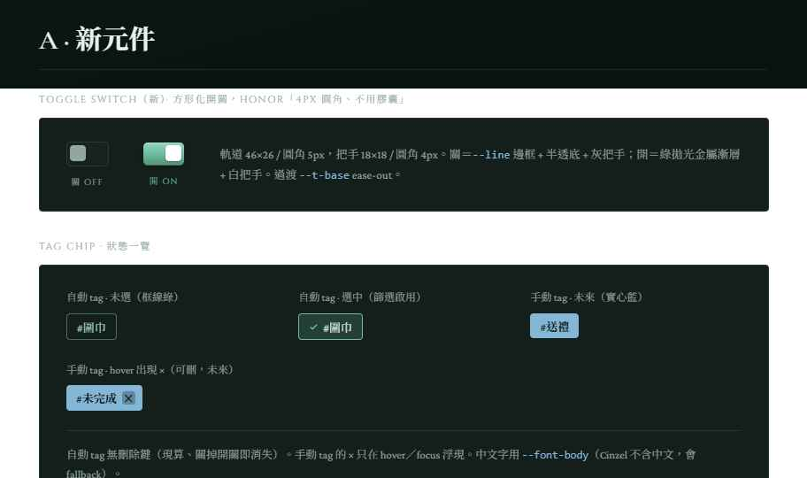
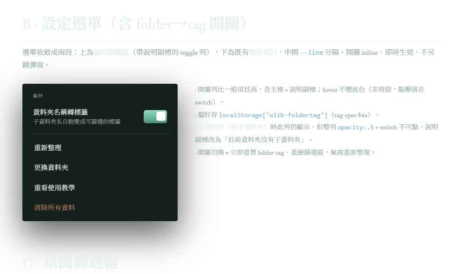
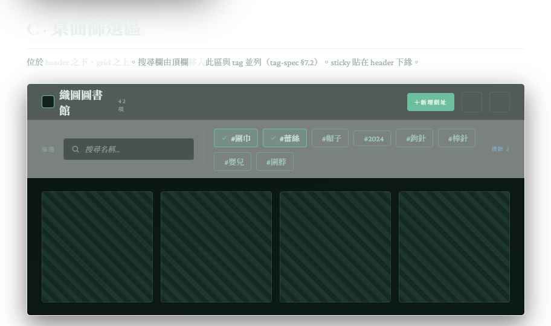
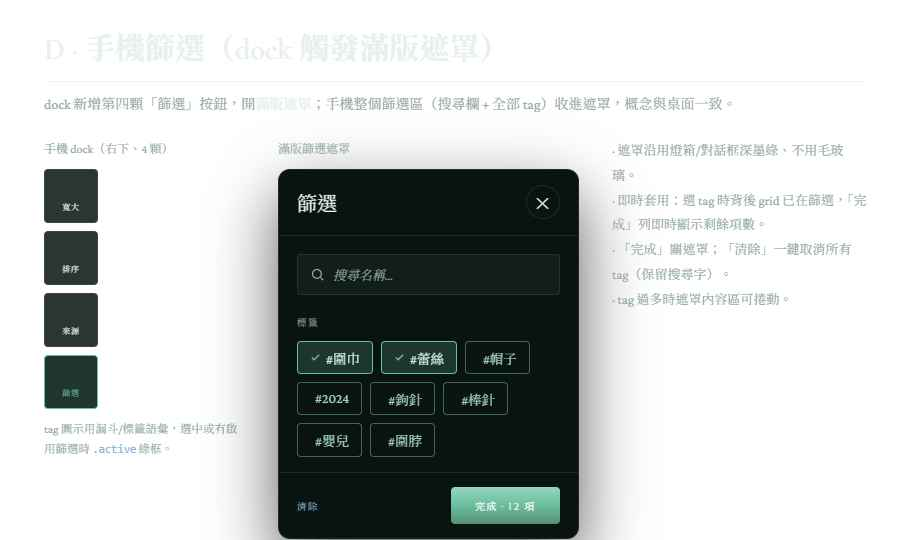
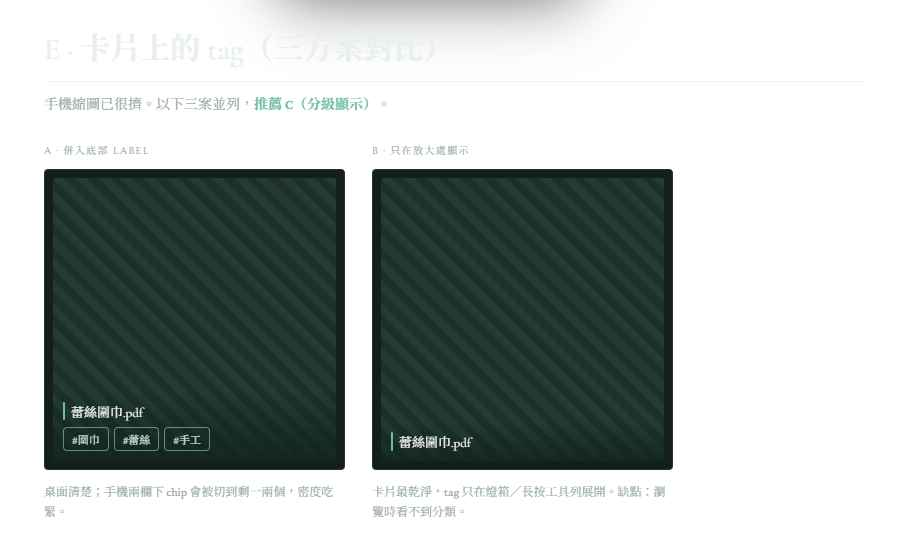

# Spec：標籤（Tag）系統

> ✅ 狀態：自動 tag 半邊**已實作**——「資料夾路徑 → 自動 tag」（§4）、folder-tag 開關（§4a）、tag 篩選（§7）、設計規格（§11）皆已落地（`js/tags.js`＋篩選區 `#filterbar`＋onboarding「資料夾標籤」步驟）。
> ✅ 手動 tag 半邊**已實作**：`files.md` 讀寫／`kv.files` 快取／災難復原（`js/files.js`）、`links.md` 的 `tags` 升一級欄位（`js/urls.js`）、chip 輸入元件（`js/tagfield.js`）、本機「編輯標籤」彈窗 `#fileTagDialog`＋URL 彈窗 tags 欄、卡片/篩選/燈箱吃 `union(auto,manual)`（`js/tags.js` `tagsOf`/`tagsOfDetailed`）、onboarding「也能自己貼標籤」純說明子畫面皆已落地，見 §6、§7.1、§9（T20–T27）、§11.6。
> 與 `About.md`（現況）、`subfolder-spec.md`（遞迴掃描）、`url-spec.md`（`links.md` 格式）同一風格。

---

## 1. 目的

讓收藏能按 tag 篩選。tag 有兩種來源：

1. **自動 tag（第一期，已實作）**：來自檔案的資料夾路徑（`圍巾/蕾絲/scarf.pdf` → `圍巾`、`蕾絲`）。隨資料夾整理自動更新；由使用者開關（§4a）。
2. **手動 tag（已實作）**：使用者自訂（`#送禮`、`#未完成`），本機檔案與 URL 條目都能標。輸入介面、儲存、孤兒策略、篩選整合皆已落地（§6、§7.1、§9 T20–T27、§11.6）。

---

## 2. 現況：兩條線的 tag 儲存難度不同

### 2.1 URL 條目

真相在根 `links.md`。`parseLinks()` 對不認識的欄位存進 `cur._extra`、`serializeLinks()` 原樣寫回（`js/urls.js`），故 `- tags: #a #b` 寫進去即無損來回。要拿來篩選需把 `tags` 從 `_extra` 升成一級欄位、parse 成陣列（第二期，§6.2）。

### 2.2 本機檔案

本機檔案不進任何 markdown，只在掃描時讀成 `kv.items` 快取，每次重新整理重建。沒有持久、可搬移的地方放本機檔案的手動 tag——由 §6.1 的 `files.md` 補（第二期啟用）。

---

## 3. 核心架構：自動 tag（live）vs 手動 tag（persisted）

- **自動 tag 是「檔案當前路徑的純函數」**，掃描時從 `path` 現算、不落地 `files.md`（是否衍生由 §4a 的開關決定）。（「現算」指從那次掃描已抓到的 `path` 計算，不是額外重掃硬碟；掃描本來只在「重新整理」時發生。）
  - 理由：若把資料夾 tag 寫進 `files.md`，使用者搬檔後舊 tag 會孤兒殘留，還要對帳去清；現算永遠正確、零同步成本。
- **手動 tag 才持久化**，寫進 `files.md`（本機）／ `links.md`（URL）。
- **重新整理對 `files.md` 只讀不寫**（與 `links.md` 現行行為一致，`About.md` §5／§11）：重掃資料夾算 folder-tag、同時讀 `files.md` 拿手動 tag，兩條線不寫在同一處，故不會互相覆蓋。`files.md` 只有在使用者透過 UI 做手動 tag 的 CRUD（第二期）時才被更新，走 `links.md` 那套讀-改-寫原子寫回。
- **某檔 ／ 條目最終顯示的 tag ＝ union(自動 tag, 手動 tag)**，正規化後去重（實作見 §7.1 `tagsOf`、§11.6.4）。
- 第一期（只做自動 tag）不需動 `files.md`——自動 tag 與 `items` 一樣是記憶體衍生資料。`files.md` 是手動 tag 的地基，格式與啟用細節見 §6.1，第二期實作（§8）。

---

## 4. 資料夾路徑 → 自動 tag 的規則

輸入：`subfolder-spec.md` 幫每個 item 帶出的相對路徑 `path`。

- **除檔名外的每一層資料夾都各自成一個 tag**：`圍巾/蕾絲/scarf.pdf` → `圍巾`、`蕾絲`。
- **頂層檔案**（直接在根）：無資料夾 → 無自動 tag（即「未分類」）。
- 正規化見 §5。

---

## 4a. folder-tag 開關與觸發

- **開關**：folder→tag 是**使用者可開關的持久偏好**（存 localStorage，比照 `wlib-sort` 等）＋設定選單一個切換入口，可隨時改。
- **遞迴與 tag 分離**：遞迴掃描（顯示子資料夾的檔案）**恆開**；本開關只控制「是否把資料夾名轉成 tag」。關閉時子資料夾檔案照樣攤平顯示，只是不掛 folder-tag。
- **關閉＝不 parse 路徑**：folder-tag 現算不落地（§3），關閉即不衍生、tag 立即消失，**無殘留要清**。
- **詢問形式＝復用 onboarding 的互動步驟**（同一個版面，見 `onboarding-spec.md`），不另做對話框。觸發條件：**偵測到資料夾內有子資料夾**且偏好尚未設定。資料夾是平的（無子資料夾）則不觸發。
  - **新使用者**：走 onboarding 時在該互動步驟做選擇。
  - **既有使用者**：點上線 toast → 重新整理掃出子資料夾 → **單獨播放該步驟**讓其選擇。
  - 兩條路寫**同一個 localStorage 偏好**，不重複問；答完記住，之後改用設定選單切換。
- **「有子資料夾」判準**：掃描結果存在 `path` 含資料夾層的檔案。空的子資料夾不算（開了也不會產生任何 tag）。
- **偏好值**：`localStorage["wlib-foldertag"]` ＝ `"on"` ／ `"off"`；**未設定（null）＝尚未詢問**。互動步驟除「按開關＝開啟」外，氣泡另設**「先不開啟」次要鈕**（寫入 `"off"` 並推進）；**跳過**該步（含跳過整場教學、關閉單步播放）視同「先不開啟」→ 寫入 `"off"`，之後不再自動詢問，改由設定選單切換。
- **關閉開關時**：同步**清空已選中的 tag 篩選**（避免畫面被看不見的條件卡住）。已選 tag 本身**不持久化**（比照搜尋字，重開頁面即清空）。

---

## 5. Tag 資料模型 ／ 語法

- **語法**：hashtag（`#蕾絲`、`#cable-knit`）。中文 OK；tag 內不含空白（多字詞用 `-` ／ `_`）。
- **正規化**：**畫面顯示保留原樣**（資料夾叫 `Lace` 就顯示 `Lace`）；但**判斷「兩個 tag 是不是同一個」**（用於篩選比對與去重）時，先把兩邊各做兩步再比：
  1. **轉小寫**——`Lace`／`lace`／`LACE` 視為同一個。（中文無大小寫，不受影響。）
  2. **Unicode NFC**——把「看起來一樣、位元卻不同」的字（例如組合字元 é = `e`+`́` 對上單一碼位 `é`）正規化成同一種，避免同一個 tag 被當成兩個。
  - **資料夾名也吃這套**：資料夾名直接變自動 tag，所以 `Lace/` 與 `lace/` 會被視為同一個 tag、篩選時合併。
  - **合併後顯示哪個原樣**：同一 tag 有多種寫法（`Lace` ／ `lace`）時，篩選區 badge 顯示**出現次數較多**的寫法；平手取先掃到者。

---

## 6. 手動 tag 的儲存（已定案）

兩條線各自落地，沿用 `links.md` 的哲學（app 管理、屬於使用者、可外部編輯 ／ diff、可搬、災難復原），且**與自動 tag 無耦合**（自動現算、手動落地，§3）。

### 6.1 本機檔案：`files.md`（資料夾根目錄）

```markdown
# Yarn Library Files

- 圍巾/蕾絲/scarf.pdf
  - tags: #送禮 #未完成
```

- **key＝相對路徑**（與 `subfolder-spec.md` 的 `path` 對齊）。
- **只存手動 tag**（自動 tag 現算，不寫進來，見 §3）。**沒有手動 tag 的檔案不進 `files.md`**，維持檔案精簡。
- **重新整理只讀不寫 `files.md`**（比照 `links.md`，`About.md` §11）：重掃資料夾算自動 tag、同時讀 `files.md` 拿手動 tag，兩條線不寫在同一處、不互相覆蓋。
- **CRUD 走讀-改-寫原子寫回**：只有使用者透過編輯彈窗（§11.6）改手動 tag 時才寫 `files.md`，比照 `urls.js` 的 `reparseForWrite()`（讀磁碟 → re-parse → 改記憶體單一條目 → temp+move 原子寫回 → 更新快取），順便吃進外部編輯器對其他條目的修改。
- **災難復原**：`files.md` 壞掉／遺失時比照 `links.md`——從 `kv.files` 快取重建，原檔備份成 `files.md.broken-{timestamp}`，跳非阻斷 toast。解析器保留不認識的欄位原樣（比照 `parseLinks` 的 `_extra`），未來擴欄不破壞舊資料。
- 解析器容錯同 `parseLinks`：`- path` 行是 flat list item（`- 相對路徑`），縮排的 `- tags: …` 是其欄位。

#### 孤兒條目（T21）

檔案被改名／搬移／外接碟未接時，`files.md` 裡以路徑為 key 的條目會對不到現有檔案（＝孤兒）。File System Access API 拿不到穩定檔案 ID，`path` 已是最穩的 key，這個先天限制躲不掉，故採：

- **孤兒條目保留不刪**（比照 `links.md` 保留未知欄位的哲學）：檔案改回原名／外接碟接回，手動 tag 自動回歸。
- **不做救回 UI**；風險告知放在**最相關的當下**——編輯標籤彈窗底部一行小灰字（§11.6.2）。onboarding 只說明「可手動加 tag」與「tag 存在 `files.md`／`links.md`」，**不放孤兒警語**（§9a）。
- **空條目清除規則**：寫回時若某條目手動 tag 清空且**對得到現有檔案** → 移除該條目；**對不到檔案（孤兒）→ 保留**（不因暫時對不到就誤刪使用者的標註）。

#### 快取：`kv.files`（T22）

- IndexedDB `weaving-lib` 的既有 `kv` store **新增一個 key** `files`＝`[{path, tags:[…]}]`，當顯示快取＋災難復原副本，角色與 `kv.urls` 完全對稱。
- **只是加 key，不新增 object store、不升 IndexedDB 版本**（沿用 `About.md` §5「不指定版本開啟」的做法）。真相仍是 `files.md`。
- 用途：cache-first 開 app 時沒有使用者手勢、拿不到資料夾授權，`kv.files` 讓本機卡片的手動 tag 免授權即可立即顯示、重整不閃掉（同 `kv.urls` 對 URL 縮圖的角色）。
- **換資料夾時必須與 `kv.urls` 一起清掉**（`folder-switch-spec.md` §6.1 清 IndexedDB 清單）：`kv.files` 既然與 `kv.urls` 完全對稱，就必須套用同一條「換資料夾＝乾淨重來」保證。**漏清的後果**：換到沒有 `files.md` 的新資料夾時，`loadFiles()` 會 fallback 讀到舊資料夾殘留的 `kv.files`，記憶體 `filesMap` 帶著舊資料夾的手動 tag（同名相對路徑的新檔誤顯示舊 tag；若新資料夾有壞 `files.md` 更會被 `recoverFiles` 寫進新資料夾）——正是 `folder-switch-spec.md` §1 point 2 當初為 `kv.urls` 寫的那條外洩風險。**任何新增的「與資料夾綁定的 `kv` key」都要回頭補進 §6.1 清單。**

### 6.2 URL 條目：`links.md` 的 `tags` 欄位

- 格式：`  - tags: #a #b`（空白分隔；tag 內不含空白，§5）。
- 現況：`parseLinks()` 已把 `tags:` 存進 `_extra`、`serializeLinks()` 原樣寫回（無損來回）。**要能篩選需把 `tags` 從 `_extra` 升成一級欄位**：`parseLinks` 加 `else if (key === "tags") cur.tags = val`、`hydrateUrl`/`stripUrl` 帶上 `tags` 陣列、`serializeLinks` 在 `added` 之後、其餘 `_extra` 之前輸出 `tags` 行。
- CRUD 沿用既有 `saveEditUrl`／`saveNewUrl` 讀-改-寫，`kv.urls` 快取自然涵蓋（tags 進了 entry 就一起被快取）。

### 6.3 「本機檔案唯讀」語意澄清（T24）

`About.md` 的「本機卡片不出現編輯 ／ 刪除鈕」指的是**檔案內容本身**；`files.md` 是 app 管理的標註檔（同 `links.md`），寫 tag **不算改使用者原始檔**。因此本機卡片新增的「編輯標籤」入口與此唯讀原則不衝突——它動的是 `files.md`，不碰 PDF／圖片本身，也**沒有刪除實體檔的能力**（§11.6）。實作時同步補進 `About.md` §6.1／§9。

---

## 7. Tag 篩選

### 7.1 語意

- **多選 AND（交集）**：選多個 tag → 同時符合全部才顯示。
- **與現有篩選疊加**：`applyFilter()` 現做「檔名搜尋 + 來源篩選」，tag 再加一層 AND，總體＝搜尋 ∩ 來源 ∩（所有選中 tag）。
- **比對用 `tagsOf(it) = union(autoTags, manualTags)`**（去重，比對 key＝NFC+lowercase，§5）：手動 tag 上線後，`applyFilter()`／`tagStats()`／`renderFilterbar()`／`cardTagsHTML()` 一律改吃這個 union，而非只吃 `autoTags`（T26）。
- **URL 與 tag 篩選（T13，已更新）**：自動 tag 半邊上線時，URL 無自動 tag → 選中任一 tag 必被濾出（屬當時的預期行為）。**手動 tag 上線後此點改變**：帶有相符手動 tag 的 URL 條目會留下；`applyFilter` 對 URL 也要算 `manualTags`（即 `links.md` 的 `tags`）。原 T13 敘述隨之作廢，見 §9 T26。

### 7.2 版面位置

- **篩選區＝搜尋欄 + tag badge 合成一個區塊**（兩者同屬「篩選」功能）。tag 以一堆 badge 呈現。
- **桌面**：此篩選區置於 **header 之下、grid 之上**；原本的搜尋欄**移入**此區塊與 tag 並列。
- **手機**：dock 新增一顆按鈕，開啟**滿版遮罩**；手機版的整個篩選區（**搜尋欄 + 全部 tag badge**）都收進此遮罩，概念與桌面一致（篩選區 = 這個遮罩）。

### 7.3 自動 vs 手動 tag 的視覺區分（已定案）

- 自動 tag＝綠 `--accent` **框線**、手動 tag＝藍 `--accent2` **實心**（§11.1）。避免使用者誤以為能刪自動 tag。
- **同一 tag 既自動又手動時（T25）**：**手動優先，顯示藍實心**。卡片 chip 一律純顯示、**不帶 `×`**；刪除只發生在編輯彈窗，且在彈窗按 `×` 移除某手動 tag 後若它同時也是自動 tag，chip **不消失、退回綠框**並提示「已移除手動標籤，此標籤仍由資料夾『X』自動產生」（詳見 §11.6）。

---

## 8. 分期範圍

**第一期（已實作）**：資料夾路徑 → 自動 tag（§4）、folder-tag 開關（持久偏好＋設定選單切換＋偵測子資料夾時詢問一次，§4a）、tag 資料模型 ／ 正規化（§5）、最小 tag 篩選（§7）。

**第二期（已實作）**：手動 tag 全套——
- `files.md` 啟用＋`kv.files` 快取＋孤兒策略＋災難復原（§6.1）。
- `links.md` 的 `tags` 欄位升為一級欄位（§6.2）。
- 本機卡片「編輯標籤」入口（推翻「本機卡片無編輯鈕」的設計，唯讀語意已澄清，§6.3）、URL 沿用既有彈窗加 tag 欄（§11.6）。
- chip 輸入元件＋既有 tag 建議列（§11.6）。
- 篩選／卡片改吃 `union(auto, manual)`（§7.1、T26）。
- onboarding 折進既有「資料夾標籤」步驟、純說明（§9a、`onboarding-spec.md` §9.1）。

---

## 9. 已決定事項一覽

| #   | 議題         | 決定                                                              |
| --- | ------------ | ----------------------------------------------------------------- |
| T1  | 本機儲存架構 | Sidecar markdown `files.md`（僅存手動 tag）                        |
| T2  | 自動 vs 手動 | 自動 tag 從 path 現算不落地；手動 tag 才寫 `files.md`；重新整理對 `files.md` 只讀不寫 |
| T3  | 本回合範圍   | 只做「資料夾→自動 tag」＋最小篩選；手動編輯延後                    |
| T4  | 語法         | hashtag、中文 OK、tag 內不含空白、比對用小寫+NFC                   |
| T5  | 路徑→tag     | 除檔名外每一層資料夾各成一個 tag                                   |
| T6  | 篩選語意     | 多選 AND（交集）；與搜尋、來源篩選皆 AND 疊加                      |
| T7  | folder-tag 開關 | 使用者可開關的持久偏好＋設定選單切換；關閉＝不 parse 路徑（無殘留）；遞迴恆開、只切換是否轉 tag |
| T8  | 觸發詢問     | 偵測到子資料夾且偏好未設定時詢問一次；與 onboarding 步驟共用同一 localStorage 值 |
| T9  | 篩選區版面   | 搜尋欄 + tag badge 合成篩選區；桌面置 header 下 ／ grid 上；手機整個篩選區（含搜尋欄）收進 dock 觸發的滿版遮罩 |
| T10 | 自動 ／ 手動區分 | 以顏色 + 樣式區分（具體樣式設計階段定；手動 tag 上線後顯現）        |
| T11 | tag 顯示原樣 | 同一 tag 多種寫法 → badge 顯示出現次數較多者；平手取先掃到者 |
| T12 | 篩選狀態持久化 | 已選 tag 不持久化（比照搜尋字）；關閉 folder-tag 開關時清空已選 tag |
| T13 | URL 與 tag 篩選 | URL 條目無自動 tag → 選中任一 tag 即被濾出，屬預期行為 |
| T14 | 偏好值與跳過 | `wlib-foldertag`＝`"on"`／`"off"`、null＝未詢問；互動步驟設「先不開啟」鈕；跳過（含跳過整場教學）＝寫 `"off"` 不再問 |
| T15 | 版面切換 | 桌面／手機斷點 600px；篩選區單一 DOM、CSS 切換；搜尋欄單一 `#search` |
| T16 | sticky 行為 | 補位貼頂：header 收合時篩選區貼住視窗頂端 |
| T17 | 有子資料夾判準 | 掃描結果存在 `path` 含資料夾層的檔案；空子資料夾不算 |
| T18 | 卡片 tag 區點擊 | 桌面點卡片 tag 區 → 開燈箱（看完整 tag）；點其他處照舊開檔 |
| T19 | 燈箱佈局 | >600px 預覽圖×側欄左右並排、側欄底部對齊（圖放大、開啟鈕不被裁）；≤600px 直向堆疊 |
| T20 | 手動 tag 儲存 | 本機＝`files.md`（sidecar，key＝相對路徑，只存手動 tag，無手動 tag 的檔案不進檔）；URL＝`links.md` 的 `tags` 升為一級欄位。兩者 CRUD 皆走 `links.md` 那套讀-改-寫原子寫回＋災難復原（§6） |
| T21 | 孤兒策略 | `files.md` 對不到現有檔案的條目**保留不刪**（檔案回來自動回歸）；不做救回 UI，風險告知放在**編輯標籤彈窗底部小灰字**（§11.6.2），非 onboarding；空 tag 且非孤兒才移除條目（§6.1） |
| T22 | 手動 tag 快取 | 既有 `kv` store **新增一個 key** `files`＝`[{path, tags:[]}]`，比照 `kv.urls`；**不新增 store、不升 IndexedDB 版本**。真相仍是 `files.md`（§6.1） |
| T23 | 輸入介面 | chip 輸入元件（沿用 `.tag` badge 樣式）＋既有 tag 建議列（來源＝全庫 `tagStats` union，點選加入）。commit 只用 **Enter（擋 IME 組字中）＋blur**，**不用空白鍵**（與中文選字衝突）；Backspace 刪末顆；正規化 key 去重。URL 沿用同一 `openDialog` 加一欄；本機開新「編輯標籤」彈窗（§11.6） |
| T24 | 本機編輯入口 | 本機卡片加「編輯標籤」動作（**標籤 icon、非鉛筆**，與 URL 卡「編輯＝改內容」區隔），**無刪除鈕**（刪不了實體檔）。桌面 hover 浮出、手機長按工具列左側放此鈕。唯讀語意＝檔案內容唯讀，`files.md` 標註不算改原檔（§6.3） |
| T25 | 自動＋手動同 tag 顯示 | **手動優先（藍實心）**。卡片 chip 純顯示不帶 `×`；編輯彈窗按 `×` 移除某手動 tag 後若它也是自動 tag → chip 不消失、退回綠框並提示（§7.3、§11.6） |
| T26 | 篩選／卡片整合 | 一律改吃 `tagsOf(it)=union(auto, manual)` 去重；手動 tag 編輯後觸發卡片 chips＋篩選區重繪（比照 `applyFoldertag`）。彙整 chip `#x +N` 的 N 含手動；lead chip 取 `tagsOf` 首顆（自動在前、手動在後）。**原 T13「URL 必被濾出」作廢**（§7.1） |
| T27 | onboarding | 手動 tag **折進既有「資料夾標籤」步驟**、放在**篩選區介紹之前**、**純說明（👀）不需操作**；**只說明「可手動加 tag」與「tag 存在 `files.md`／`links.md`」**，孤兒警語改放編輯彈窗小灰字（T21、§11.6.2）。不新增互動步驟、不升 onboarding 版本（§9a、`onboarding-spec.md` §9.1） |

---

## 9a. 教學文案（onboarding；實作時才逐字移入 `js/constants.js`）

> 對應 `onboarding-spec.md` §9.1 的新步驟「資料夾標籤」。依偵測結果兩種形式。語氣 ／ 格式沿用 `constants.js` 既有 `OB_SCREENS`。

### 有子資料夾 → 互動步驟（徽章 🖱 換你試試）

**開場 dialog** — 標題「資料夾也能當標籤」：

```
你的檔案有分資料夾放嗎？
網頁可以把「資料夾名稱」自動變成標籤，
讓你用標籤快速篩選（例如只看「圍巾」或「蕾絲」）。

來決定要不要開啟吧！
```

**spotlight**（指向 folder-tag 開關，`target`＝`#foldertagSwitch`；`interactive`）：

```
按這顆開啟「資料夾標籤」。
之後隨時能在右上角設定選單裡開 ／ 關。
```

- 觸發：使用者按下開關 → 寫入偏好（`wlib-foldertag`）→ 推進。屬「做了會生效」，比照「試試新增網址」的「儲存」。
- 氣泡另設**「先不開啟」次要鈕**：寫入 `"off"` 並推進（不想開的人不必跳過整場教學，§4a）。

### 無子資料夾 → 純說明步驟（徽章 👀 看過就好）

標題「資料夾也能當標籤」：

```
把檔案分到不同子資料夾裡，
網頁可以把資料夾名稱自動變成標籤，方便篩選。

你這個資料夾目前還沒有子資料夾；
之後有了，網頁會再問你要不要開啟。
```

### （併入「資料夾標籤」步驟）手動 tag 純說明（純說明，徽章 👀 看過就好）

> **放在開關 spotlight 之後、篩選區 spotlight 之前**（`onboarding-spec.md` §9.1 子流程），**純說明、不需操作**（T27）。此畫面**兩種形式都播**（有／無子資料夾皆有，因手動 tag 與子資料夾無關）；若技術上綁在「資料夾標籤」步驟的互動子流程內，無子資料夾時可獨立成一張純說明對話框。
> **只說明「可手動加 tag」與「tag 存放位置」**；孤兒風險（改檔名會對不上）改由**編輯標籤彈窗底部的小灰字**當場提醒（§11.6.2），不放在 onboarding。

A 模式對話框，標題「也能自己貼標籤」：

```
除了資料夾自動變成的標籤，
你也可以自己幫檔案或網址貼標籤，例如 #送禮、#未完成

這些自己貼的標籤會存在資料夾的 files.md（檔案）和 links.md（網址）裡，屬於你、可以自己搬或編輯。
```

### （併入「資料夾標籤」步驟）篩選區 spotlight（純說明，徽章 👀 看過就好）

> **不放工具列巡禮**：tag 介面在桌面與手機都與搜尋欄同屬一個篩選區，手動 tag 純說明之後接著介紹（`onboarding-spec.md` §9.1 子流程 ④）。桌面指 header 下的篩選區；手機指 dock 第 4 顆「篩選」鈕。**無子資料夾（純說明形式）時不播此 spotlight**。

指向篩選區（`target`＝`#filterbar`；手機改指 dock 第 4 顆 `#filterBtn`）：

```
用標籤篩選收藏，也有搜尋欄可以使用。
```

---

## 10. 與其他 spec 的關係

- **`subfolder-spec.md`**：提供 `path`，是自動 tag 的輸入。兩份一起設計。
- **`url-spec.md`**：`links.md` 解析器已容忍未知欄位；第二期把 `tags` 從 `_extra` 升成一級欄位（§6.2）。
- **`About.md`**：已同步——§5（`files.md`／`kv.files`）、§6.1（唯讀語意澄清）、§10（手動 tag 由「待做」改「已實作」）。
- **`onboarding-spec.md` §9.1**：已定案——手動 tag **折進既有「資料夾標籤」步驟**、放在篩選區介紹之前、純說明不需操作（§9a、T27）；本輪已同步增修 `onboarding-spec.md`。

---

## 11. 設計規格（implementation-ready）

> 本章由設計階段回填，供實作者直接對照。完整互動稿見專案內 `Tag Feature Designs.dc.html`；截圖存於 `spec-assets/`。所有值沿用 `design-style.md` 既有 token（`--accent #6dbd9f`、`--accent2 #84b6d6`、`--line`、`--card-solid #141f1c`、`--font-body/head/disp`、4px 圓角、`--t-base` ease-out）。**不引入新色、不引入無襯線字、任何元素不用 `backdrop-filter`/`filter`**。

### 11.0 核心設計決定

| 項 | 決定 |
| --- | --- |
| 自動 tag 樣式 | 綠 `--accent`、**框線**風格（量大、每卡都有，框線讓畫廊不被色塊淹沒；綠色一眼即「網頁生成」） |
| 手動 tag 樣式 | 藍 `--accent2`、**實心**風格（稀少、刻意，實心副色最醒目）。第一期僅示意；第二期編輯入口／輸入介面已定案，見 §11.6 |
| 共通 | 兩者皆帶 `#` 前綴、**不用 icon**、4px 圓角、中文走 `--font-body`（Cinzel 不含中文） |
| folder→tag 開關 | 設定選單內 **inline toggle switch**，不另跳彈窗（見 §11.2） |
| 卡片上的 tag | **C 分級顯示**（見 §11.4）：桌面標準/寬大卡展開整排；緊湊卡與手機卡一顆彙整 chip `#圍巾 +2`；完整清單一律在燈箱與長按工具列 |

### 11.1 新元件



**Toggle Switch（新）** — 方形化以 honor「4px 圓角、不用膠囊」。軌道 `46×26`／圓角 `5px`，把手 `18×18`／圓角 `4px`；過渡 `--t-base` ease-out。

```html
<!-- OFF -->
<button class="wl-switch" role="switch" aria-checked="false"><span class="knob"></span></button>
<!-- ON：aria-checked="true"，加 .on -->
```
```css
.wl-switch { width:46px; height:26px; border-radius:5px; border:1px solid var(--line);
  background:var(--card); position:relative; cursor:pointer; transition:var(--t-base) ease-out; }
.wl-switch .knob { position:absolute; top:3px; left:3px; width:18px; height:18px; border-radius:4px;
  background:var(--muted); transition:var(--t-base) ease-out; }
.wl-switch.on { border:none; background:linear-gradient(180deg,
  color-mix(in srgb,var(--accent) 78%,#fff), var(--accent) 50%, color-mix(in srgb,var(--accent) 82%,#000));
  box-shadow: inset 0 1px 0 rgba(255,255,255,.25), inset 0 -1px 0 rgba(0,0,0,.2); }
.wl-switch.on .knob { left:auto; right:3px; background:#fff; }
```

**Tag Chip 狀態**

```css
/* 自動 tag：框線綠（未選） */
.tag { display:inline-flex; align-items:center; gap:5px; padding:5px 11px; border-radius:4px;
  font-family:var(--font-body); font-size:13px; cursor:pointer; transition:var(--t-fast) ease-out;
  border:1px solid color-mix(in srgb,var(--accent) 42%,var(--line)); background:transparent; color:#a9d8c6; }
/* 自動 tag：選中（篩選啟用）——加勾 + accent 底 */
.tag.sel { border-color:var(--accent); background:color-mix(in srgb,var(--accent) 20%,transparent); color:#d6f0e5; }
.tag.sel::before { content:""; width:11px; height:11px; /* 用內嵌 ✓ svg，stroke var(--accent) */ }
/* 手動 tag（未來）：實心藍，可刪 */
.tag.manual { border:none; background:var(--accent2); color:#0a1614; font-weight:600; }
.tag.manual .x { display:none; } .tag.manual:hover .x, .tag.manual:focus-within .x { display:inline-flex; }
```
- 自動 tag **無刪除鍵**（現算，關開關即消失，§3）；手動 tag 的 `×` 只在 hover/focus 浮現。

### 11.2 設定選單（含 folder→tag 開關）



選單收斂成兩段：上為**偏好開關區**（帶說明副標的 toggle 列），下為既有**動作項目**，中間 `1px var(--line)` 分隔。開關 inline、**即時生效**（切換即重算 folder-tag、重繪篩選區，無需按重新整理）、不另跳彈窗。

```html
<div class="menu-list">
  <div class="menu-group-label">偏好</div>
  <div class="menu-toggle">
    <div class="mt-txt"><div class="mt-title">資料夾名稱轉標籤</div>
      <div class="mt-sub">子資料夾名自動變成可篩選的標籤</div></div>
    <button class="wl-switch on" role="switch" aria-checked="true"><span class="knob"></span></button>
  </div>
  <div class="menu-sep"></div>
  <button class="menu-item">重新整理</button>
  <button class="menu-item">更換資料夾</button>
  <button class="menu-item">重看使用教學</button>
  <button class="menu-item" style="color:#d08672">清除所有資料</button>
</div>
```
- `.menu-group-label`：`--font-disp` 9px、`letter-spacing:.18em`、大寫、`--muted`。
- `.menu-toggle` 比一般項目高，含主標 + 說明副標；**hover 不變底色**（點擊落在 switch）。
- **平資料夾（無子資料夾）**：此列仍顯示，整列 `opacity:.5` + switch 不可點，副標改「目前資料夾沒有子資料夾」。
- 偏好存 `localStorage["wlib-foldertag"]`（§4a）。

### 11.3 篩選區

**桌面**（`spec-assets/C-filter-desktop.png`）：位於 **header 之下、grid 之上**，`position:sticky` 貼 header 下緣。搜尋欄由頂欄**移入**此區與 tag 並列（§7.2）。



```html
<div class="filterbar">
  <span class="fb-label">篩選</span>
  <div class="fb-search"><svg class="i-search"></svg><input id="search" placeholder="搜尋名稱…"></div>
  <div class="fb-sep"></div>
  <div class="fb-tags"><!-- .tag / .tag.sel，依出現次數多→少排序，flex-wrap 換行 --></div>
  <button class="fb-clear">清除 2</button>   <!-- 選中≥1 才顯示 -->
</div>
```
- 版面：`display:flex; align-items:center; gap:14px; padding:14px var(--gutter); flex-wrap:wrap;` 底色 `color-mix(in srgb,var(--bg3) 55%,transparent)`。
- `.fb-label` `--font-disp` 大寫；`.fb-sep` 是 `1px var(--line)` 直線分隔搜尋與 tag。
- **無自動 tag**（平資料夾或關閉開關）→ 整條只留搜尋欄。
- **sticky 補位貼頂**：篩選區 `position:sticky; top:0`；header 往下捲收合（`nav-hidden`）時，篩選區滑上貼住視窗頂端，捲動中隨時能搜尋 ／ 篩選；header 展開時自然被推回其下緣。
- **桌面 ／ 手機切換斷點＝600px**（與現有 header ／ dock 斷點一致）。
- **搜尋欄維持單一 `#search` DOM**：桌面 bar 與手機滿版遮罩是**同一塊篩選區 DOM**，以 CSS 依斷點切換呈現，不做兩個 input 同步。

**手機**（`spec-assets/D-filter-mobile.png`）：dock 新增第 4 顆「篩選」按鈕（漏斗/標籤語彙圖示，有啟用篩選時 `.active` 綠框），開**滿版遮罩**；手機整個篩選區（搜尋欄 + 全部 tag）收進遮罩。



- 遮罩沿用燈箱/對話框深墨綠、**不用毛玻璃**；結構：標題列（「篩選」+ ✕）→ 搜尋欄 → 「標籤」段標 + tag 雲 → 底列（「清除」+ 綠 primary「完成 · N 項」）。
- **即時套用**：選 tag 時背後 grid 已在篩選，「完成」列即時顯示剩餘項數；「完成」關遮罩，「清除」取消所有 tag（保留搜尋字）。tag 過多時內容區可捲動。
- 多選 **AND（交集）**；與搜尋、來源篩選皆 AND 疊加（§7.1）。

### 11.4 卡片上的 tag（採 C 方案 · 分級顯示）



| 情境 | 呈現 |
| --- | --- |
| 桌面 標準/寬大卡 | `.label` 內、檔名下方**展開整排** mini chip（`flex-wrap`，框線綠） |
| 緊湊卡 & 手機卡 | 檔名下方**一顆彙整 chip**：`#圍巾 +2`（`+N` 用較淡的 `#92c9b4`）；點/長按看全部 |
| 燈箱 & 手機長按工具列 | **完整 tag 清單**（標題下方置中） |

```html
<!-- 卡片 mini chip（label 內），比篩選 chip 小：padding 3px 9px、font 11px、框線 rgba(150,206,180,.6)、色 #cdeadf -->
<div class="card-tags"><span class="ctag">#圍巾</span><span class="ctag">#蕾絲</span><span class="ctag">#手工</span></div>
<!-- 彙整版：--> <span class="ctag">#圍巾 <span class="more">+2</span></span>
```
- 卡片 mini chip **非篩選互動點**；**桌面點卡片的 tag 區 → 開燈箱**（完整 tag 清單在那；點 tag＝想看分類，不該開檔），點卡片其他處照舊開檔／開連結。觸控裝置點卡片本來就是開燈箱，不變。
- 觸控裝置（`@media (hover:none)`）緊湊卡一律用彙整 chip，避免 label 過擠。
- **實作方式**：展開整排與彙整 chip **兩種 DOM 都渲染**進 `.label`，以 CSS 依 `.size-*` 與 `(hover:none)` 控制顯示其一，切換檢視大小時不重建卡片。
- 手機長按工具列的完整 tag 清單：置於**工具列本體上方**一列（工具列無標題，「標題下方」語意僅適用燈箱）。
- **燈箱佈局（>600px）**：預覽圖與側欄（分隔線＋標題＋tag＋開啟鈕）**左右並排、側欄底部對齊**——圖高幾乎吃滿視窗、開啟鈕不會被裁掉；≤600px 退回直向堆疊。

### 11.5 與現有 CSS 的接點

- 新 class 建議前綴 `wl-` 或沿用既有命名慣例；集中放在 `css/style.css` 既有分區（`.dock`、`.menu-list`、`.card`/`.label`、`.overlay`）附近。
- 篩選區是**新 DOM**：插在 `header` 與 `main > .grid` 之間；`applyFilter()` 需再加一層 tag AND（總體＝搜尋 ∩ 來源 ∩ 所有選中 tag，§7.1）。
- dock 第 4 顆按鈕沿用 `.dock-btn` 規格；手機遮罩沿用 `.overlay` 規格（深墨綠、無毛玻璃）。

### 11.6 手動 tag：編輯入口與輸入介面（第二期，已實作）

沿用既有 design system（`.overlay` 對話框＝`design-style.md` §7.4、`.tag` chip＝§11.1、`--accent2` 藍實心＝手動），**不引入新色、不引入無襯線字、任何元素不用 `backdrop-filter`/`filter`**。

#### 11.6.1 編輯入口（T24）

| 平台／來源 | 入口 |
| --- | --- |
| 桌面 URL 卡 | 既有 `.card-actions`（`.edit` 鉛筆＋`.del` 垃圾桶），不變 |
| 桌面 本機卡 | `.card-actions` **只放一顆「編輯標籤」鈕**（標籤 icon，非鉛筆；**無刪除鈕**），hover 浮出，沿用 `.card-actions` 規格 |
| 手機 URL 卡 | 長按工具列左側＝編輯／刪除（`touch.js` 現況），不變 |
| 手機 本機卡 | 長按工具列左側改放**一顆「編輯標籤」**（`touch.js` 目前 `leftEl.innerHTML=""`，本機卡改成塞此鈕；**無刪除**） |

- 圖示用「標籤」而非「鉛筆」，明確是「編輯標籤」而非「改檔案內容」，呼應 §6.3 唯讀語意。
- 本機卡片的 tag 區點擊（§11.4／T18：桌面點 tag 區＝開燈箱）不變；「編輯標籤」是獨立的 action 鈕，不是點 chip。

#### 11.6.2 兩個彈窗

- **URL（沿用既有 `openDialog`，加一欄）**：在「網址／標題／縮圖」之下加一列「標籤」＝chip 輸入（§11.6.3）。`saveNewUrl`/`saveEditUrl` 把 chips 併進 `links.md` 的 `tags`（§6.2）。
- **本機（新彈窗 `#fileTagDialog`，沿用 `.overlay` 骨架）**：
  - 標題「編輯標籤」。
  - 一列**檔名唯讀顯示**（`prettyTitle(name)`，灰字、不可編輯——只是讓使用者知道在標哪個檔）。
  - 一組 chip 輸入（§11.6.3）。
  - **底部一行小灰字提醒**（`--muted`、`.mt-sub` 等級小字）：「標籤是依檔名和位置記住的，之後改檔名或搬資料夾會對不上；舊標籤仍留在資料夾的 `files.md` 裡。」——把孤兒風險放在**最相關的當下**（T21），不靠使用者記得 onboarding 說過什麼。
  - 底部「取消／儲存」；**無縮圖、無 URL、無刪除鈕**。
  - 儲存 → 走 `files.md` 讀-改-寫（§6.1）＋更新 `kv.files`＋重繪該卡 chips 與篩選區（`refreshCardTags`＋`renderFilterbar`＋`applyFilter`，比照 `applyFoldertag`）。

#### 11.6.3 chip 輸入元件（T23）

兩個彈窗共用同一元件。

```html
<div class="wl-tagfield">
  <div class="wl-chips"><!-- .tag.manual chips（含 × 刪），最後接一個 input --></div>
  <input class="wl-tag-input" placeholder="輸入標籤後按 Enter…">
  <div class="wl-tag-suggest"><!-- 既有 tag 建議，點一下加入 --></div>
</div>
```

- **視覺**：chip 用 §11.1 的 `.tag`／`.tag.manual`（藍實心）；此處 chip 一律帶可刪 `×`（**編輯情境**，與卡片純顯示不同，§7.3）。
- **commit（成一顆 chip）只在**：按 **Enter**、或 **input 失焦（blur）**。**不用空白鍵 commit**——中文注音／拼音輸入時空白＝選字鍵，會把組字中的詞誤切。
- **擋 IME 組字中**：`compositionstart`/`compositionend` 或 `event.isComposing` 為真時，Enter 不 commit（交給 IME 選字）。
- **Backspace**：input 為空時按 Backspace 刪掉最後一顆 chip。
- **正規化去重**：commit 時 strip 前導 `#`、trim，算 `tagKey`（NFC+lowercase，§5）；已存在（含既有自動 tag 的 key）則不重複加、input 清空即可。
- **既有 tag 建議列**：來源＝全庫 `tagStats()` 的 union（依出現次數排序），點一下加入輸入；已加入的不再出現在建議。輸入中可依 input 字串即時過濾建議。
- **儲存前空白容錯**：使用者忘打 `#` 也接受（commit 時補）；一顆 chip 內若含空白則整串視為多顆（以空白切）。

#### 11.6.4 卡片／篩選區與手動 tag 的整合（T25／T26）

- `cardTagsHTML(it)` 改吃 `tagsOf(it)=union(auto, manual)`：自動綠框、手動藍實心；**卡片 chip 一律不帶 `×`**（純顯示）。彙整 chip `#x +N` 的 N 含手動；lead 取 `tagsOf` 首顆（自動在前、手動在後）。
- 同一 key 既自動又手動 → **顯示藍實心（手動優先）**；於編輯彈窗按 `×` 移除該手動 tag 後，因自動仍在，chip **退回綠框不消失**，並 toast「已移除手動標籤，此標籤仍由資料夾『X』自動產生」。
- 篩選區 `tagStats`／`renderFilterbar` 改吃 union；同 key 混合來源在篩選區 badge 亦以**手動優先（藍實心）**呈現，與卡片一致。
